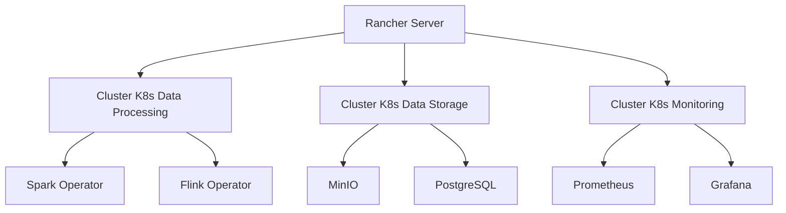
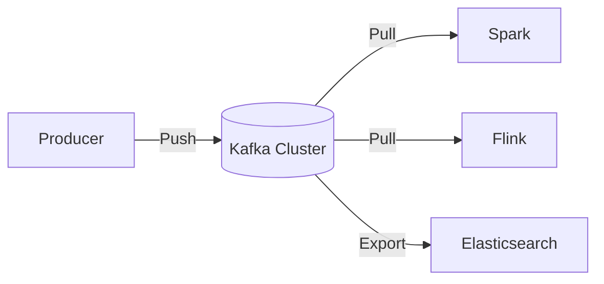
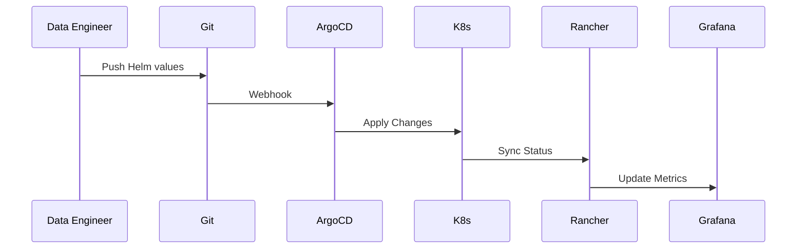

# **Lien entre Big Data, Kubernetes, Rancher, Helm et 5 autres technologies : Une Vision 360°**  

## **🔍 Introduction**  
Dans un écosystème **Big Data / Big Analytics**, plusieurs technologies collaborent pour rendre les données exploitables à grande échelle. Voici une **vision simplifiée et interconnectée** de leur rôle.  

| Technologie | Rôle dans le Big Data | Lien avec les autres |
|-------------|----------------------|----------------------|
| **Big Data** | Traite des volumes massifs (Spark, Kafka, Hadoop). | S’exécute sur **Kubernetes**. |
| **Kubernetes (K8s)** | Orchestre les conteneurs (Spark, Flink, etc.). | Géré par **Rancher**. |
| **Rancher** | Simplifie la gestion de **multi-clusters K8s**. | Déploie avec **Helm**. |
| **Helm** | Package et déploie des apps (ex: Spark Operator). | Utilise **Kafka** pour le streaming. |
| **Kafka** | Messagerie temps réel (flux de données). | Monitoré par **Prometheus**. |
| **Prometheus** | Collecte les métriques (performance, erreurs). | Visualisé dans **Grafana**. |
| **Grafana** | Tableaux de bord pour l’analyse. | Alerte les **Data Engineers**. |
| **ArgoCD** | GitOps pour déploiements automatisés. | Synchronise les **Helm Charts**. |
| **MinIO** | Stockage S3 compatible (pour données brutes). | Utilisé par **Spark/Flink**. |

---

## **🌐 Vision 360° : Comment tout s’assemble ?**  

### **1. Big Data a besoin de Kubernetes (K8s)**  
- **Problème** : Les frameworks Big Data (Spark, Flink) doivent scaler dynamiquement.  
- **Solution** : Kubernetes orchestre des conteneurs **Spark Executors**, **Flink TaskManagers**, etc.  

### **2. Kubernetes est complexe → Rancher le simplifie**  
- **Problème** : Gérer plusieurs clusters K8s (AWS, On-Premise) est difficile.  
- **Solution** : Rancher offre une **UI unique** pour :  
  - Déployer des clusters.  
  - Configurer RBAC (qui accède à quoi ?).  
  - Monitorer via Prometheus.  

### **3. Rancher utilise Helm pour déployer des apps**  
- **Problème** : Installer Kafka, Spark à la main est pénible.  
- **Solution** : Helm permet de :  
  - **Packager** des apps (ex: `spark-operator`).  
  - **Répliquer** la même config en DEV/PROD.  

### **4. Helm déploie Kafka pour le Streaming**  
- **Cas d’Usage** :  
  - **Kafka** ingère des flux de données (logs, transactions).  
  - **Flink/Spark** les traitent en temps réel.  

### **5. Prometheus + Grafana surveillent tout ça**  
- **Métriques clés** :  
  - Latence Kafka.  
  - Échecs de jobs Spark.  
  - Utilisation CPU/RAM.  

### **6. ArgoCD automatise les déploiements**  
- **GitOps** :  
  - Le dépôt Git contient les **Helm Charts**.  
  - ArgoCD applique les changements automatiquement.  

### **7. MinIO stocke les données brutes**  
- **Alternative à HDFS** :  
  - Compatible S3 → Utilisable par **Spark, Flink, Jupyter**.  

---

## **🎯 Synthèse : 5 Points Clés**  
1. **Kubernetes** est le socle pour exécuter des apps **Big Data**.  
2. **Rancher** simplifie la gestion de **multi-clusters K8s**.  
3. **Helm** permet de déployer **Spark, Kafka, Flink** en 1 clic.  
4. **Prometheus/Grafana** surveillent les performances.  
5. **ArgoCD** et **MinIO** automatisent et stockent.  

---

-----

# **Écosystème Big Data Modern: Détails Approfondis des Interactions entre Kubernetes, Rancher, Helm et les Autres Technologies**

## **1. Kubernetes: Le Socle de l'Orchestration Big Data Moderne**

### **Fonctionnement Détaillé**
Kubernetes agit comme:
- **Un système nerveux central** pour les workloads Big Data
- **Un orchestrateur intelligent** qui gère:
  - Le scheduling des pods (unités de calcul)
  - L'équilibrage de charge
  - La tolérance aux pannes
  - L'allocation dynamique des ressources

### **Intégration avec les Frameworks Big Data**
| Framework | Intégration K8s | Avantages |
|-----------|----------------|-----------|
| **Apache Spark** | Spark Operator | Découplage driver/executors |
| **Apache Flink** | Native K8s | Session/Job modes |
| **Kafka** | Strimzi Operator | Scaling élastique |
| **Presto/Trino** | Custom pods | Isolation des queries |

### **Défis Techniques Résolus**
- **Auto-healing**: Redémarrage automatique des composants défaillants
- **Bin packing**: Optimisation de l'utilisation des ressources
- **Rolling updates**: Mises à jour sans interruption

## **2. Rancher: La Couche de Gouvernance Multi-Clusters**

### **Architecture Avancée**


### **Fonctionnalités Clés**
- **Federation de clusters**: Gestion unifiée de multiples environnements
- **Rancher Projects**: Isolation logique des équipes/projets
- **Global DNS**: Service discovery cross-cluster
- **Backup Operator**: RPO/RTO configurables

### **Cas d'Usage Avancés**
1. **Multi-cloud Load Balancing**:
   - Répartition des jobs Spark entre clouds
   - Affinity rules pour la data locality

2. **Security Hardening**:
   - CIS Benchmarking automatisé
   - Scan continu des vulnérabilités

## **3. Helm: L'Artifact Manager du Big Data sur K8s**

### **Décomposition d'un Chart Big Data Typique**
```
spark-operator/
├── Chart.yaml
├── values.yaml
├── templates/
│   ├── deployment.yaml
│   ├── rbac.yaml
│   └── webhook.yaml
└── crds/
    └── sparkapplications.yaml
```

### **Workflow Professionnel**
1. **Développement**:
   - `helm lint` pour validation
   - `helm template --debug` pour prévisualisation

2. **CI/CD**:
   - Packaging: `helm package --sign`
   - Publication: `helm push vers registry`

3. **Déploiement**:
   - Versioning: `helm upgrade --version x.y.z`
   - Rollback: `helm rollback <release> <revision>`

### **Best Practices Enterprise**
- **Dependency Management**:
  ```yaml
  dependencies:
    - name: prometheus
      repository: https://prometheus-community.github.io/helm-charts
      version: 15.0.0
      condition: prometheus.enabled
  ```
- **Value Overrides Hierarchiques**:
  ```bash
  helm install -f values.yaml -f env/prod.yaml --set key=value
  ```

## **4. Kafka: Le Système Circulatoire des Données**

### **Architecture sous Kubernetes**


### **Configuration Helm Avancée**
```yaml
# values-strimzi.yaml
kafka:
  replicas: 6
  config:
    auto.create.topics.enable: "false"
    num.partitions: 12
  resources:
    requests:
      memory: "8Gi"
      cpu: "2"
  storage:
    type: jbod
    size: "1Ti"
    class: "gp3"
```

### **Patterns de Conception**
- **Consumer Groups**: Pour le parallel processing
- **Exactly-Once Semantics**: Via transactions
- **Topic Compaction**: Pour les KTables

## **5. Prometheus & Grafana: Le Système Nerveux Central**

### **Architecture de Monitoring**
```
Prometheus -->|Scrape| K8s API
Prometheus -->|Scrape| Node Exporters
Prometheus -->|Scrape| JVM (Spark/Flink)
Prometheus -->|Store| TSDB
Grafana -->|Query| Prometheus
Grafana -->|Alert| Alertmanager
```

### **Dashboard Clés**
1. **Spark Executor Metrics**:
   - GC Pressure
   - Shuffle I/O
   - Task Duration

2. **Kafka Cluster Health**:
   - Under Replicated Partitions
   - Consumer Lag
   - Network Throughput

## **6. ArgoCD: Le Cerveau GitOps**

### **Workflow Complet**


### **Configuration Type**
```yaml
# Application CRD
apiVersion: argoproj.io/v1alpha1
kind: Application
metadata:
  name: spark-prod
spec:
  destination:
    namespace: spark
    server: https://rancher.example.com/k8s/clusters/c-12345
  source:
    repoURL: https://git.example.com/helm-charts.git
    path: spark-operator
    targetRevision: HEAD
    helm:
      values: |
        image:
          tag: v3.1.1
        resources:
          limits:
            cpu: 2
```

## **7. MinIO: Le Système Lymphatique de Stockage**

### **Topologie de Déploiement**
```
MinIO Cluster (4 nodes)
├── Tenant A (Spark)
│   ├── Bucket: raw-data
│   └── Bucket: processed
└── Tenant B (Flink)
    ├── Bucket: streams
    └── Bucket: checkpoints
```

### **Optimisations Performances**
- **Erasure Coding**: 4+2 configuration
- **Cache Tiering**: NVMe pour hot data
- **Lifecycle Management**: Transition vers glacier

## **Synthèse des Interactions Clés**

| Interaction | Protocole | Fréquence | Impact |
|------------|----------|-----------|--------|
| Spark ↔ K8s | K8s API | 10s/sec | Critique |
| Rancher ↔ Helm | HTTP | 1/min | Important |
| Kafka ↔ Prometheus | Metrics scrape | 15s | Essentiel |
| ArgoCD ↔ Git | Webhook | Event-based | Fondamental |

## **Checklist d'Implémentation Professionnelle**

- [ ] Configurer HPA (Horizontal Pod Autoscaler) pour Spark
- [ ] Acturer Network Policies entre namespaces
- [ ] Mettre en place Thanos pour Prometheus long-term storage
- [ ] Configurer OPA/Gatekeeper pour la compliance
- [ ] Automatiser les backups etcd avec Rancher

Cet écosystème combiné permet de supporter des charges de travail Big Data exigeantes tout en maintenant une gouvernance centralisée et une operational excellence.
